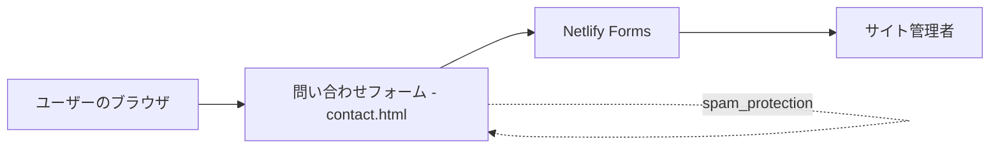
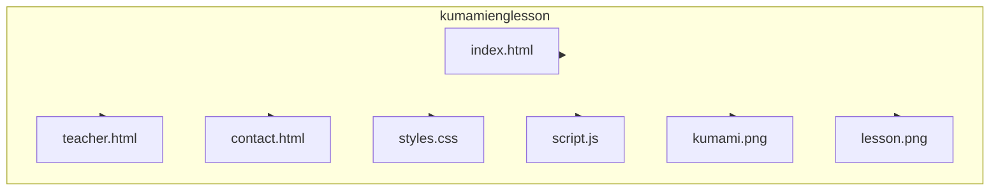

# 絶対あきらめない！大人の英語塾 (Kumami English Lesson)

## 概要

このリポジトリは、シンプルな静的サイト（HTML/CSS/JavaScript）で作られた日本語の英語学習サービスの紹介サイトです。お問い合わせフォームは Netlify フォーム機能を利用しており、ハニーポットと reCAPTCHA によるスパム対策を組み合わせて安全にメール送信を行います。

## 機能

- 問い合わせフォーム: フロントエンドのフォームから Netlify 経由でメール送信（`contact.html`）。
- スパム対策（ポイント機能）: ハニーポット（`bot-field`）と `reCAPTCHA` を組み合わせて自動送信を防止。
- レスポンシブ UI: モバイル向けの簡単なメニューを含むレスポンシブデザイン（`styles.css`, `script.js`）。
- よくある質問・連絡先表示: サイト内に説明セクションを用意。

## 技術スタック

- 言語: `HTML`, `CSS`, `JavaScript`
- ホスティング / フォーム受信: `Netlify`（静的サイト + Netlify Forms）
- 外部サービス: `Google reCAPTCHA`（Netlify と併用）

公式ロゴ（外部公開 SVG を埋め込み）:


## 環境構築手順

- リポジトリをクローン:

```bash
git clone git@github.com:hideaki1979/kumamienglesson.git
cd kumamienglesson
```

- ローカルで確認するだけならファイルをブラウザで開くだけで動作します（静的サイト）。例:

```bash
open index.html
```

- Netlify にデプロイする手順（概要）:

1. `https://app.netlify.com/` でアカウントを作成
2. Projectsの右側にある、Add newprojectをクリック
→ Import an existing projectを選択
3. 画面下部にある「Try Netlify Drop」リンクを押下
4. 該当フォルダを選択してドラッグ＆ドロップでデプロイ完了
5. `contact.html` のフォームは Netlify Forms を利用するため、フォーム送信後に Netlify 上の「Forms」から「Enable form detection」ボタンを押下
6. しばらくすると、Form notificationsのボタンが表示されるので押下する。
7. 「Form submission notifications」の「Add notification」を押下し、
「Email notification」を選択。
8. Event to listen forはデフォルトのまま、Email to notifyは受信したいメールアドレス、
Custom email subject lineは送信タイトル、Formはcontactを選択してSave押下


## Mermaid 図

プロジェクト構成（フロー）:



ディレクトリ構成



簡易ディレクトリ一覧（ルート）:

- `index.html` : トップページ
- `teacher.html` : 講師紹介ページ
- `contact.html` : お問い合わせフォーム（Netlify Forms）
- `styles.css` : 共通スタイル
- `script.js` : モバイルメニューなどのスクリプト
- `kumami.png`, `lesson.png` : 画像アセット

## デプロイ時の注意点（Netlify Forms + reCAPTCHA）

- `contact.html` のフォームに `data-netlify="true"` と `name="contact"` が設定されていることを確認してください。
- reCAPTCHA を使う場合、Netlify のドキュメントに従い、`data-netlify-recaptcha="true"` をフォームに追加します（既に実装済み）。
- ハニーポットフィールド（`bot-field`）はフォーム内で非表示にしておくことで、ボット検出に有効です。
